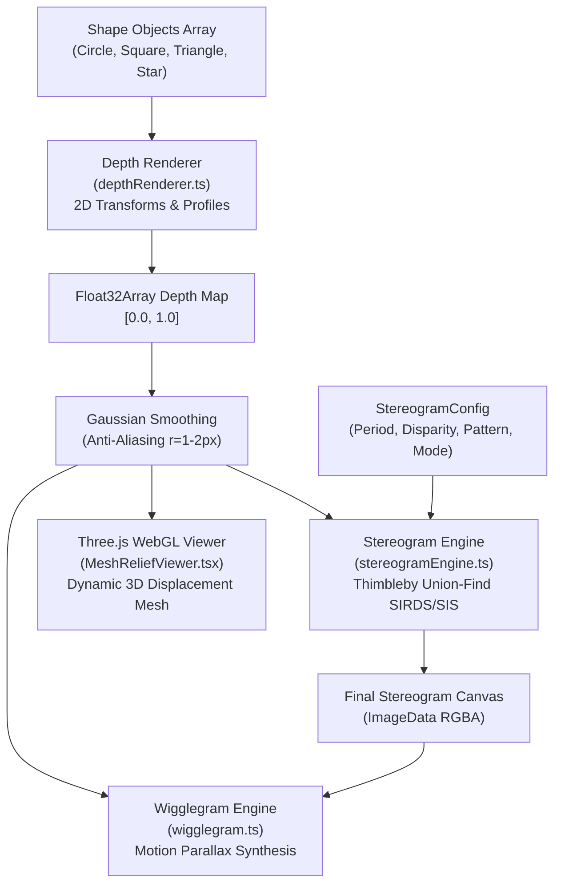

# StereoMagic Studio Architecture

## 1. System Overview

StereoMagic Studio is built on a modular, decoupled pipeline where **scene definition**, **depth map synthesis**, **autostereogram compilation**, and **3D visualization** are completely independent layers.

---

## 2. Core Modules & Responsibilities

| File Path | Module | Responsibility |
| :--- | :--- | :--- |
| [`src/types/index.ts`](file:///c:/Users/toreb/OneDrive/Code/Stereogram/src/types/index.ts) | Type Definitions | Definitions for `ShapeObject`, `DepthProfileType`, `StereogramConfig`, `PatternType`. |
| [`src/core/depthRenderer.ts`](file:///c:/Users/toreb/OneDrive/Code/Stereogram/src/core/depthRenderer.ts) | Depth Renderer | Computes $z(x, y)$ from shape transformations (rotation, scaling, translation), applies relief profiles (Dome, Pyramid, Beveled, Flat), and performs separable Gaussian smoothing. |
| [`src/core/stereogramEngine.ts`](file:///c:/Users/toreb/OneDrive/Code/Stereogram/src/core/stereogramEngine.ts) | Stereogram Engine | Implements Thimbleby-Inglis-Witten Union-Find equivalence class solver, line-of-sight ray marching for occlusion removal, procedural pattern generators, and guide dot stamping. |
| [`src/core/wigglegram.ts`](file:///c:/Users/toreb/OneDrive/Code/Stereogram/src/core/wigglegram.ts) | Wigglegram Engine | Generates perspective-shifted views from depth buffer for motion-parallax wiggle stereoscopy. |
| [`src/core/mazeGenerator.ts`](file:///c:/Users/toreb/OneDrive/Code/Stereogram/src/core/mazeGenerator.ts) | Maze Generator | Procedural recursive-backtracking generator providing guaranteed solvable, perfect mazes. |
| [`src/core/textDepthRenderer.ts`](file:///c:/Users/toreb/OneDrive/Code/Stereogram/src/core/textDepthRenderer.ts) | 3D Text Rasterizer | Renders embossed 3D alphanumeric strings and numbers directly into depth buffers with sub-block beveling. |
| [`src/core/labyrinthRenderer.ts`](file:///c:/Users/toreb/OneDrive/Code/Stereogram/src/core/labyrinthRenderer.ts) | Labyrinth Renderer | Pre-renders 3D corridor walls and goal pads, composites dynamic ball and floating 3D time text, and computes collision physics. |
| [`src/components/LabyrinthGame.tsx`](file:///c:/Users/toreb/OneDrive/Code/Stereogram/src/components/LabyrinthGame.tsx) | 3D Labyrinth Game | Complete interactive 3D stereoscopic game with real-time rolling ball physics, floating 3D stopwatch, radar peek, and difficulty modes. |
| [`src/components/MeshReliefViewer.tsx`](file:///c:/Users/toreb/OneDrive/Code/Stereogram/src/components/MeshReliefViewer.tsx) | 3D Relief Mesh | Three.js WebGL component displacing a $160 \times 120$ grid plane according to depth values with dynamic metallic lighting and orbit controls. |
| [`src/components/StageEditor.tsx`](file:///c:/Users/toreb/OneDrive/Code/Stereogram/src/components/StageEditor.tsx) | 2D Canvas Stage | Direct-manipulation 2D canvas with drag-to-position, selection highlights, and depth badges. |
| [`src/components/StereogramViewport.tsx`](file:///c:/Users/toreb/OneDrive/Code/Stereogram/src/components/StereogramViewport.tsx) | Viewport & Tabs | Coordinates Stereogram, 2D Stage, Depth Map, Split View, and 3D Mesh tabs; provides Hold to Peek and Wigglegram controls. |

---

## 3. Memory & Performance Optimizations

1. **Typed Arrays (`Float32Array`, `Int32Array`, `Uint8Array`)**:
   Scanline operations avoid object allocations inside nested loops.
2. **Separable Gaussian Convolution**:
   Transforms an $O(W \times H \times (2r+1)^2)$ 2D blur into two 1D passes of $O(W \times H \times 2(2r+1))$, executing in $< 2\text{ ms}$.
3. **Bounding-Box Pruning**:
   Shapes only evaluate pixels within their rotated bounding boxes rather than traversing the entire canvas.
